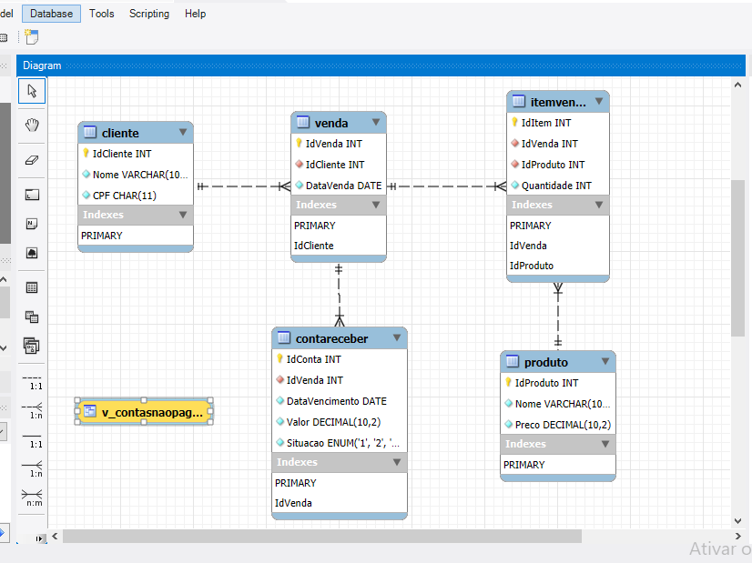

# Projeto Banco de Dados - Loja

Este projeto foi desenvolvido como atividade prática da disciplina **Programação e Desenvolvimento de Banco de Dados**. A proposta envolveu modelagem e implementação de um banco de dados relacional para uma loja fictícia, utilizando **MySQL**.

## 🔍 Objetivos

- Criar tabelas baseadas em um modelo DER
- Inserir dados nas tabelas com comandos SQL
- Consultar dados com comandos SELECT
- Criar uma VIEW para listar contas não pagas

## 📁 Estrutura

- `imagens/`: screenshots das tabelas, diagrama e consultas
- `sql/`: scripts SQL com criação de tabelas, inserção e consulta
- `doc/`: relatório em Word com todos os detalhes da prática

## 🧩 Diagrama EER

## 📝 Tecnologias usadas

- MySQL Community Server
- MySQL Workbench

## 💡 Autor

Desenvolvido por **[Marcelo Rodrigues]** — Acadêmico de Ciência da Computação
